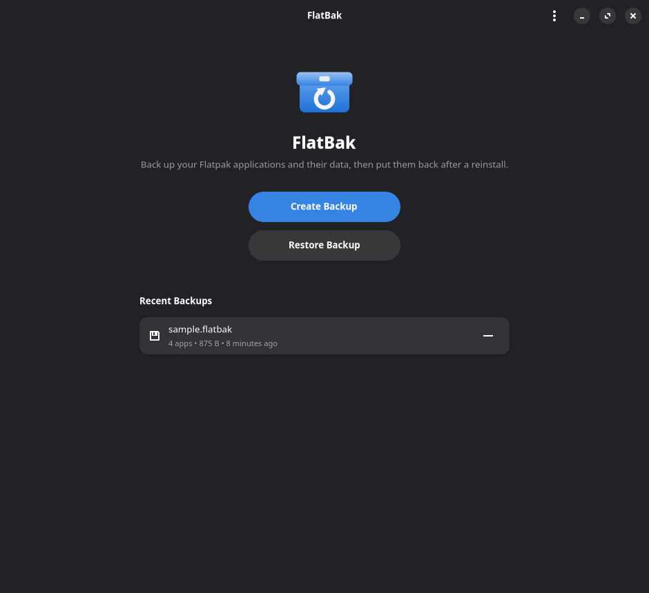
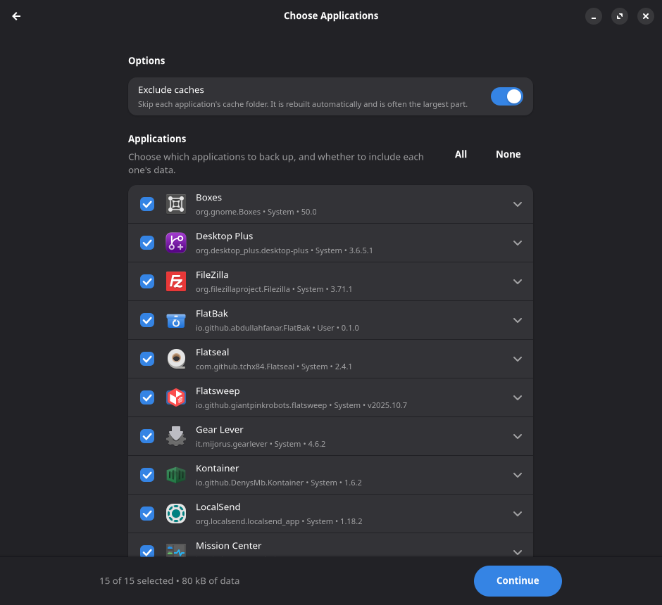
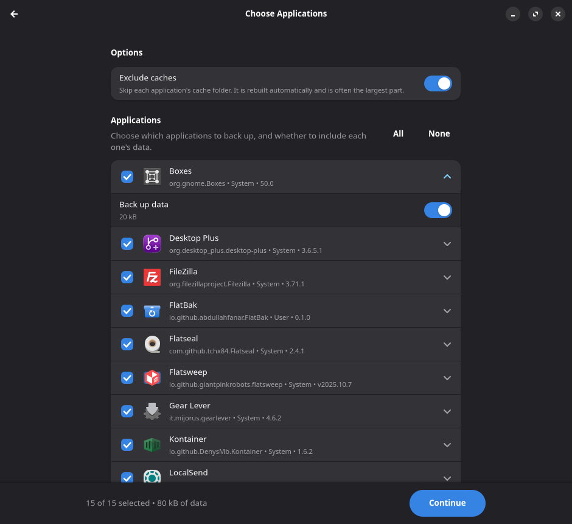
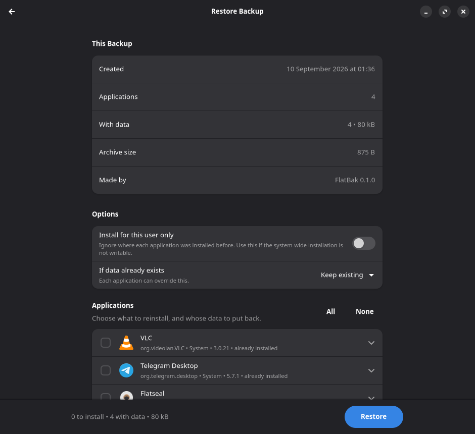
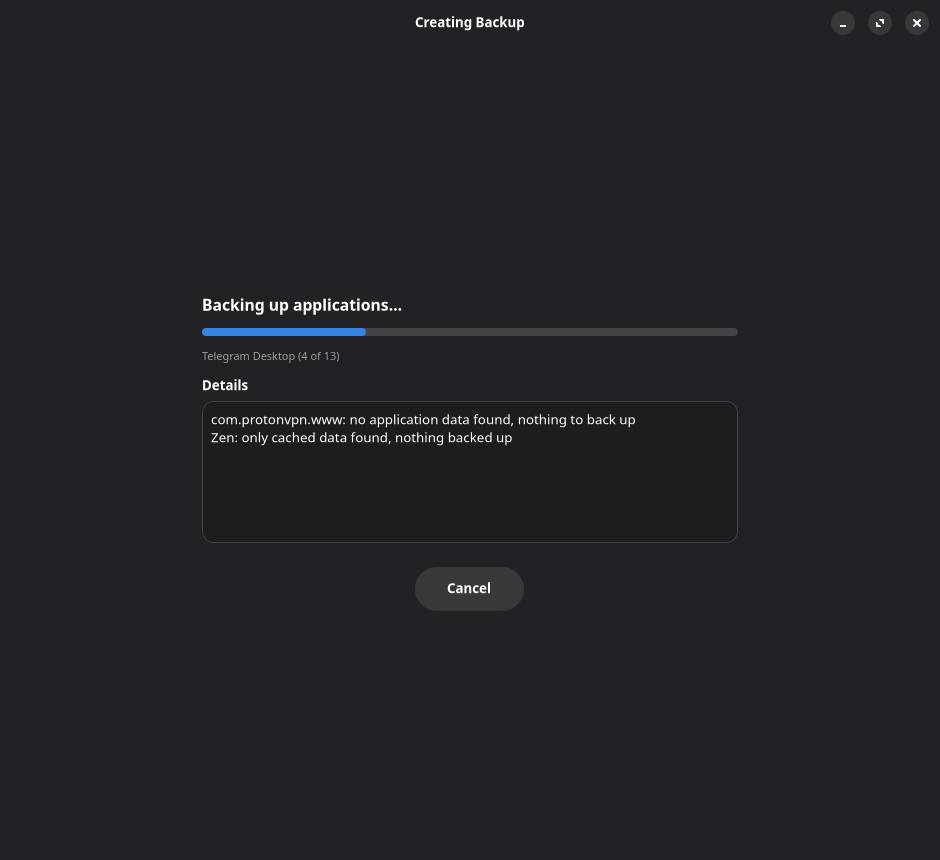
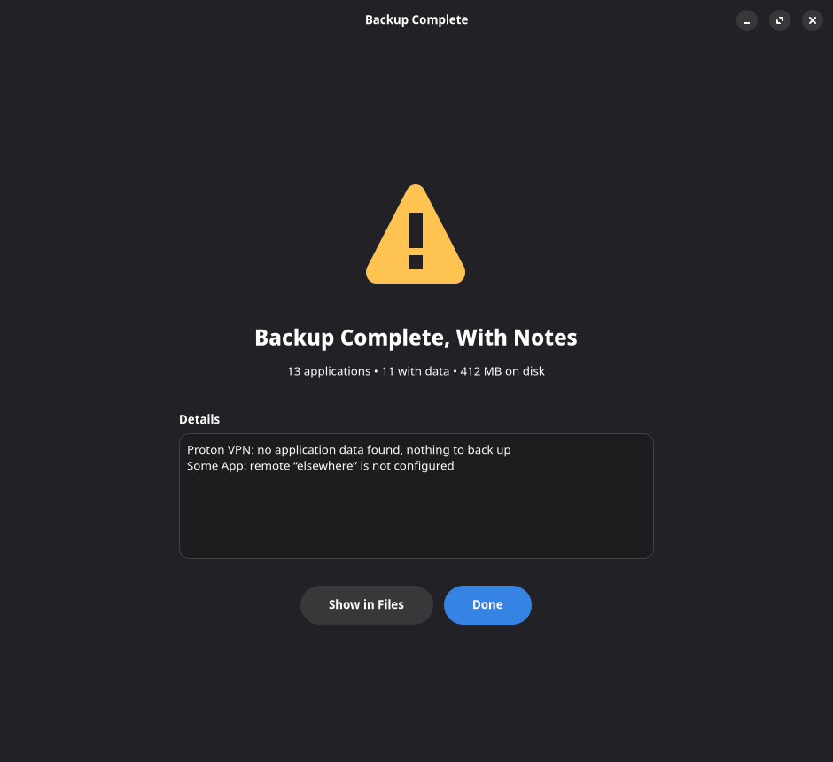

<div align="center">
  

  # FlatBak

  **Back up and restore your Flatpak applications 📦**

  [](LICENSE)
  [](https://www.rust-lang.org)
  [](https://www.gtk.org)
  [](https://gnome.pages.gitlab.gnome.org/libadwaita/)
  [](https://github.com/AbdullahFanar/FlatBak/issues)
  [](https://github.com/AbdullahFanar/FlatBak/pulls)
</div>

FlatBak is a GTK4 / Libadwaita application that backs up your installed Flatpak
applications and the user data under `~/.var/app`, writes them to a single
portable `.flatbak` file, and puts them back on another system.

It is **not** a whole-system backup tool. It covers Flatpak applications and
their data, and nothing else.

## 📸 Previews

<table>
<tr>
<td align="center"><br>Home</td>
<td align="center"><br>Choosing apps</td>
<td align="center"><br>Per-app data</td>
</tr>
<tr>
<td align="center"><br>Restoring</td>
<td align="center"><br>Progress</td>
<td align="center"><br>Result</td>
</tr>
</table>

## ✨ What it does

- 📋 Lists your installed Flatpak applications, across user and system installations.
- ✅ Lets you choose which applications to back up, and **separately** whether to
  include each one's data.
- 🗜️ Writes a single compressed `.flatbak` archive.
- 📂 Opens an existing archive, shows what is in it, and lets you choose what to
  bring back.
- 🔄 Reinstalls applications from their remotes, offering to add a remote that is
  missing on the new system.
- 💾 Restores application data to `~/.var/app/<APP_ID>`, asking before it replaces
  data that is already there.
- 📊 Reports progress, skipped applications, and every error it hit.

## 🛠️ Building

Requires Rust 1.80+, GTK 4.12+ and Libadwaita 1.6+ development packages.

```sh
# Fedora
sudo dnf install cargo gtk4-devel libadwaita-devel

# Arch
sudo pacman -S rust gtk4 libadwaita

# Debian / Ubuntu
sudo apt install cargo libgtk-4-dev libadwaita-1-dev
```

Then:

```sh
make            # debug build
make test       # unit tests
make release    # optimised build
sudo make install
```

`make install` honours `PREFIX` and `DESTDIR`. After installing, refresh the
desktop caches so the launcher, icon, and `.flatbak` file association appear;
`make install` prints the three commands.

### 📦 Building as a Flatpak

```sh
flatpak-builder --user --install --force-clean build-dir \
  io.github.abdullahfanar.FlatBak.json
flatpak run io.github.abdullahfanar.FlatBak
```

See [MAINTAINING.md](MAINTAINING.md#as-a-flatpak) for what the sandbox
permissions are for and when to regenerate `generated-sources.json`.

## 🌐 Running it somewhere Flatpak is not directly reachable

FlatBak shells out to the `flatpak` command. When it runs inside a sandbox or a
container it looks for the *host's* Flatpak instead of the container's:

| Environment | Command used |
| --- | --- |
| Normal desktop session | `flatpak` |
| Inside a Flatpak sandbox | `flatpak-spawn --host flatpak` |
| Inside toolbox / distrobox | `distrobox-host-exec flatpak` |

Override the detection with `FLATBAK_FLATPAK_CMD`, for example:

```sh
FLATBAK_FLATPAK_CMD="distrobox-host-exec flatpak" flatbak
```

`FLATBAK_DATA_ROOT` overrides the location of `~/.var/app`, which is useful for
testing against a scratch directory.

## 🗃️ The `.flatbak` format

An archive is a small binary container wrapping two compressed blocks:

```
offset  size  field
0       8     magic "FLATBAK\x1a"
8       2     container_version   u16 LE
10      2     reserved
12      4     manifest_len        u32 LE
16      8     payload_len         u64 LE
24      4     header_crc32        u32 LE   CRC-32 of bytes 0..24
28      4     reserved
32      N     manifest            zstd(TOML)
32+N    M     payload             zstd(tar)
end-40  32    payload_sha256      SHA-256 of the compressed payload
end-8   8     trailer magic "FBKEND\r\n"
```

The manifest sits at a fixed offset ahead of the payload, so opening a
multi-gigabyte backup to list its contents reads a few kilobytes instead of
decompressing the whole file.

The manifest is TOML and carries its own `format_version`, separate from the
container's. Readers ignore unknown keys, so later versions can add fields
without breaking older ones; a reader that meets a `format_version` it does not
know refuses the archive instead of guessing.

```toml
[flatbak]
format_version = 1
created_at = "2026-09-08T18:30:00Z"
created_by = "FlatBak 0.1.0"
host_arch = "x86_64"
flatpak_version = "1.18.2"
excluded_caches = true
app_count = 2
data_bytes = 20971520

[[app]]
id = "org.videolan.VLC"
name = "VLC"
version = "3.0.21"
branch = "stable"
arch = "x86_64"
origin = "flathub"
installation = "system"
ref = "app/org.videolan.VLC/x86_64/stable"
commit = "…"
installed_size = 13000000
data_included = true
data_bytes = 124000
data_files = 31
data_path = "data/org.videolan.VLC"

[[remote]]
name = "flathub"
title = "Flathub"
url = "https://dl.flathub.org/repo/"
installation = "system"
```

Recording each remote's URL is what lets a restore offer to recreate a remote
that the new system does not have yet.

The payload is a tar stream holding `data/<APP_ID>/…` for every application
whose data was included.

### 🔗 Symlinks

Application data contains symlinks, and they are preserved, but only ones that
stay inside the application's own data directory.

An absolute link that points back inside that directory (libvirt writes its
autostart links this way) is rewritten as the equivalent relative link when it
is stored. That is what makes it work after a reinstall: the new machine may
have a different user name, and therefore a different home directory, so the
original absolute path would dangle.

A link pointing anywhere else (a socket under `/run/user`, a path elsewhere on
the old system) is left out and reported during the backup, because it cannot
mean anything on the new machine.

### 🧹 Caches

By default the `cache` subdirectory of each application's data is left out. It
is regenerated automatically and is frequently the largest part of an
application's data: a browser's cache alone can be several gigabytes. Turn the
"Exclude caches" switch off to include it.

## 🔒 Safety

- Archives are written to `<name>.part` and renamed into place only once the
  header and trailer are both committed, so an interrupted backup never leaves
  something that looks usable.
- Before a restore touches anything, the container framing is checked, the
  manifest is parsed and validated, and the payload is hashed and compared with
  the trailer.
- Extraction rejects absolute paths, `..` traversal, symlinks pointing outside
  the application's own data directory, and entry types FlatBak never writes
  (hard links, device nodes, FIFOs).
- Refs handed to `flatpak install` are rebuilt from validated fields rather than
  taken verbatim from the archive.
- Existing application data is never replaced without an explicit choice, and
  the confirmation names every application affected.

## 🧑‍💻 Development

```sh
make check      # cargo check
make test       # unit and integration tests
make clippy     # lints, warnings denied
```

Two helpers exist for checking behaviour that unit tests cannot reach:

```sh
# What FlatBak sees of this machine's Flatpak state.
cargo run --example probe

# A real backup and restore cycle against this machine's own application data,
# restored into a scratch directory and compared byte for byte. Nothing on the
# system is modified.
cargo run --release --example selftest
cargo run --release --example selftest -- org.telegram.desktop

# Render every page to PNG in a headless Weston, for checking the UI without a
# desktop session. Needs `weston` installed.
cargo build --examples && tools/render-ui.sh /tmp/shots
```

## 🧭 Maintaining it

[MAINTAINING.md](MAINTAINING.md) covers the project layout, the application ID,
the logo, releases, and the format compatibility rules that keep old backups
readable.

## 🤝 Contributing

Issues are welcome! If you hit a bug, have a feature idea, or something is
unclear, please [open an issue](https://github.com/AbdullahFanar/FlatBak/issues).

Contributions are welcome too, small fixes and larger changes alike. Feel free
to open a pull request; for anything bigger, opening an issue first to talk
through the approach is appreciated but not required.

## 🤖 A note on AI

Parts of FlatBak, including code, packaging, and documentation, were written
with the help of AI tools. Everything shipped has been reviewed and tested
before being committed.

## 📄 Licence

MIT. See [LICENSE](LICENSE).
